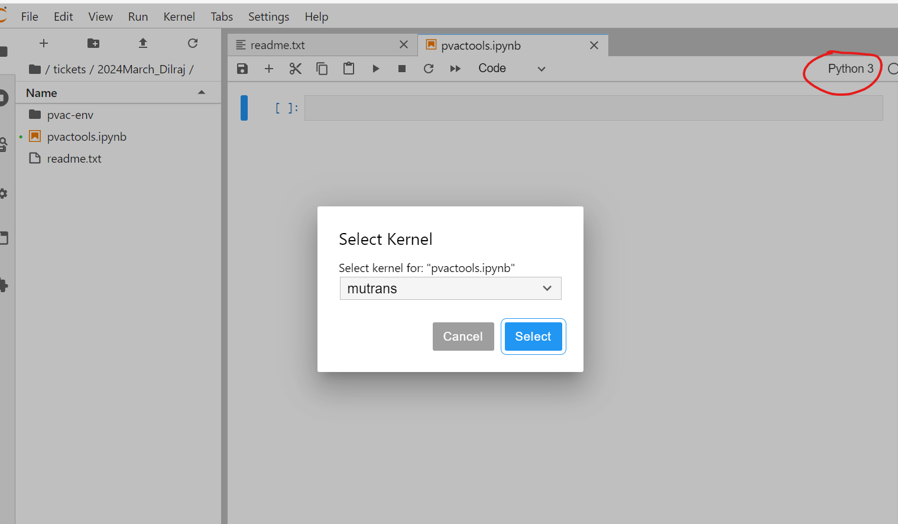

# RStudio OnDemand - Environments

Uses the central build and not environments

It is possible to use Jupyter notebook with R on alma for something interactive.  

To do this you create a conda environment in [a similar way to python](python-ondemand.md), and then install R and the IRkernel.  This is a bit more complicated than python, but it is possible.  You can then run R in a Jupyter notebook.


2. Use conda to create a new environment in the [mamba R documentation](r-scripts.md) and activate it.
```
conda create --name my-conda-r -c conda-forge -c bioconda -c r -c defaults r-base=4.3
conda activate my-conda-r
```

3. Install the r-irkernel package
```shell
conda install ipykernel r-irkernel
```

4. Activate the kernel with python
```shell
python -m ipykernel install --user --name=my-conda-r
```

5. Start Jupyter OnDemand

The dropdown for the kernels will now include this environment:



