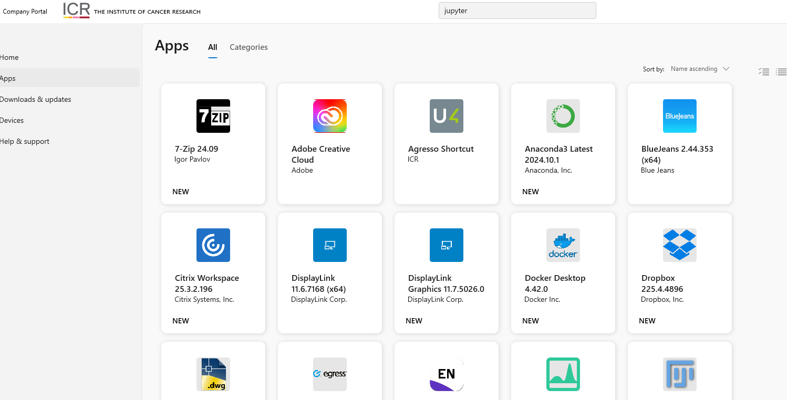
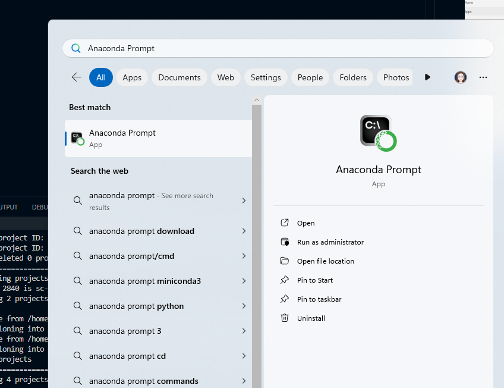
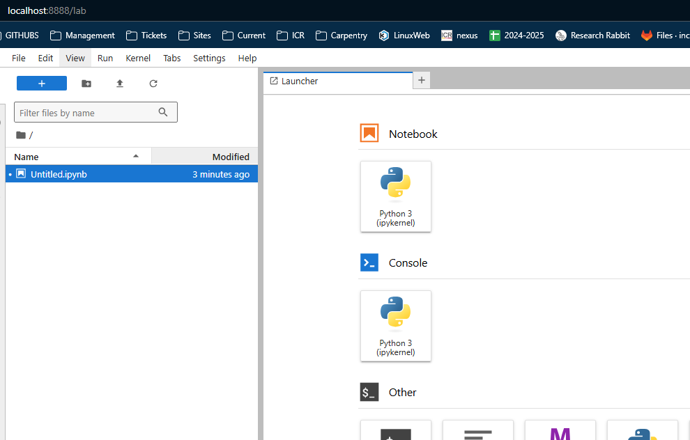
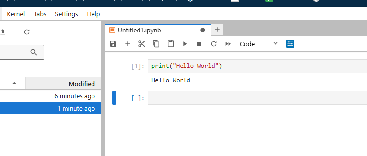

# Installing Jupyter Lab

## On Windows
At the ICR, the Company Portal has a Jupyter Lab app for Windows.
  

## On a mac
Follow this link for the mac installation instructions: 
[Anaconda mac install](https://www.anaconda.com/docs/getting-started/anaconda/install#macos-linux-installation)

## Setting up
Once installed the Anaconda Suite will appear on the Start Menu.  
Search for **Anaconda Prompt**  


Navigate to a folder that you want to save files in, eg c:/Users/ralcraft/Documents, and then type the following command:
```bash
jupyter lab
```
This will start Jupyter Lab in your default web browser.

## Check it works
You should see the default option of a Python 2 kernal, click it.


Then a jupyter notebook will appear, you can test it is working by simply typing in 
```python
print("Hello World")
```
Press the play arrow at the top - if you see the output `Hello World` then it is working correctly.


Any problems, contact [schelpdesk](mailto:schelpdesk@icr.ac.uk) asking to be put in touch with the RSE team.
