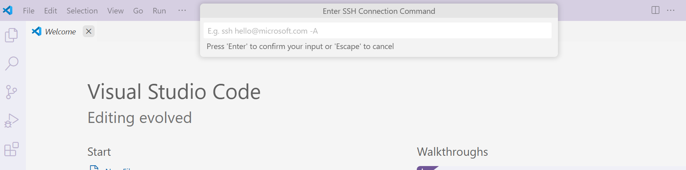

# Remote Debugging with VSCode

We have recently made it possible to connect to Alma from vscode - though only to the login nodes.

Instructions are fairly brief covering all the compnents involved - any more information needed about any compnent contact the helpdesk.

The full details are given by microsoft here: [remote-ssh with vscode](https://code.visualstudio.com/docs/remote/ssh#:~:text=Connect%20to%20a%20remote%20host&text=In%20VS%20Code%2C%20select%20Remote,hostname%20as%20in%20step%201.)  

An adaptation for Alma follows:  

### Installation
- you need to have VSCode installed
- You need to download the [remote-ssh extension](https://marketplace.visualstudio.com/items?itemName=ms-vscode-remote.remote-ssh) from the [Visual Studio Marketplace](https://marketplace.visualstudio.com/).

### SSH host setup
- You need an ssh key/pair for alma set up. Instructions are given on the vscode instructions for [ssh-keygen](https://code.visualstudio.com/docs/remote/troubleshooting#_improving-your-security-with-a-dedicated-key) if you don't have this already.

**EITHER:**  
### Connect to a remote host: login node
- In vscode you need to check that you can ssh onto alma in a vscode terminal.
- in vscode select "Connect to host" after clicking on the "remote window" icon in the far left bottom of the tool bar
- enter `ssh username@alma.icr.ac.uk`
- Select the directory with your ssh key

This will now create the connection. In the future you will be able to select this from the list when you choose a remote connection.

Alma has a 200MB memory limit for the login nodes, so you will need to use the interactive nodes for any real work. Once connected to your code with the remote-ssh extension you can use edit your code with the log in node but can have the terminal in vscode as part of an interactive session for running it.

**OR:**
### Connect to a remote host: compute node
- You will need to first log in to an interactive node on Alma with a terminal using:
```bash
ssh username@alma.icr.ac.uk
srun --pty --mem=10GB -c 2 -t 30:00:00 -p interactive bash
```
- in vscode select "Connect to host" after clicking on the "remote window" icon in the far left bottom of the tool bar
- enter `ssh -J username@alma.icr.ac.uk node01`
- Select the directory with your ssh key

This will now create the connection. In the future you will be able to select this from the list when you choose a remote connection, but you will still need to first access a log in node frrom a terminal.

