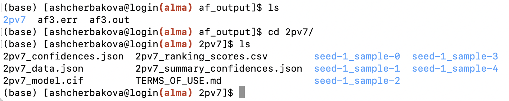

# Running Alphafold3 on Alma

This guide outlines the steps required to run AlphaFold3 on the Alma HPC. AlphaFold3 is a powerful tool for predicting protein structures, but its setup and usage require careful preparation - including downloading model parameters, configuring input files, and leveraging Singularity. 
Below, you’ll find step-by-step instructions covering everything from requesting model access to preparing job submission scripts and interpreting results.

 **Please note** that AlphaFold3 is available only for non-commercial use, and access to its model parameters must be requested individually.

*IMPORTANT:*

* You’ll need to fill out [this form](https://docs.google.com/forms/d/e/1FAIpQLSfWZAgo1aYk0O4MuAXZj8xRQ8DafeFJnldNOnh_13qAx2ceZw/viewform) to request the model files. After submission, you’ll receive an email from Google (typically within 2–3 days) containing a download link. Once you have the files, store them in your Scratch or RDS space on Alma.

* Please make sure you read the legal documents on the [outputs terms of use](https://github.com/google-deepmind/alphafold3/blob/main/OUTPUT_TERMS_OF_USE.md), [weights terms of use](https://github.com/google-deepmind/alphafold3/blob/main/WEIGHTS_TERMS_OF_USE.md) and [weights prohibited use policy](https://github.com/google-deepmind/alphafold3/blob/main/WEIGHTS_PROHIBITED_USE_POLICY.md).

* Alphafold3 only works on GPUs, therefore, you will be charged GPU rates, which is currently — 240p per GPU core per hour. 

You can find a [video tutorial](https://www.youtube.com/watch?v=iIubA9VnutQ&list=PLKk58i7WAwK48DqrcBRTOntUUGAefG-R-) on how to run Alphafold3 using the AlmaCookBook instructions on our [YouTube channel](https://www.youtube.com/@icrrseteam). Please note the video is unlisted. 

All material has been adapted from the [AlaphaFold3 GitHub repository](https://github.com/google-deepmind/alphafold3).

### Downloading AlphaFold Parameters

#### Step 1: Download the Parameters
Once you receive the download link, click it to download the file `af3.bin.zst`.

#### Step 2: Moving the File to RDS or Scratch
After downloading, you need to move the file to a suitable location on RDS or Scratch.

You can do this in one of the following ways:

1. **Via Mounted Fileshare (Recommended)**  
  If RDS or Scratch is mounted on your local machine (e.g., via SMB), simply move the file using your file explorer (drag and drop).  
  For details, see 'The Alma fileshare' section in [First Steps](first_steps.md).

2. **Via `scp` in the Terminal**  
  Use this method if you prefer the command line or the fileshare isn't mounted:

    ```bash
    scp -J username@alma.icr.ac.uk af3.bin.zst username@node01:/data/scratch/some/dir/
    ```

    Replace username and the path as appropriate.

#### Step 3: Decompressing the Parameter File
Log into Alma following "Connect to Alma and get an interactive partition" section. Once the file is on the server, load the zstd module:

```bash
module load zstd
```
Then decompress it to your desired directory (we recommend a folder like af3_model/):

```bash
zstd -d af3.bin.zst -o af3_model/af3.bin
```
You can then use the path to your parameters `some/dir/af3_model` as `<MODEL_PARAMETERS_DIR>`.

### Connect to Alma and get an interactive partition

```bash
ssh username@alma.icr.ac.uk
srun --pty -t 12:00:00 -p interactive bash
```
### Navigate to either your Scratch or RDS directory
```bash
cd /data/scratch/<your-username>   # or /data/rds/<your-username>
```

### Create a dedicated directory to run Alphafold3 and `cd` into it

```bash
mkdir alphafold3
cd alphafold3
```

### Singularity Image and Execution Script

AlphaFold3 package is wrapped up in a singularity image that is made available on Alma here `/data/rds/DIT/SCICOM/SCRSE/shared/singularity/alphafold3.sif`.
The code is invoked via the following [python code](https://raw.githubusercontent.com/google-deepmind/alphafold3/refs/heads/main/run_alphafold.py).

First copy the python code directly to the `alphafold3` directory:

```bash
wget -O run_alphafold.py https://raw.githubusercontent.com/google-deepmind/alphafold3/refs/heads/main/run_alphafold.py
```

#### Prepare input and output directories and files
Running AlphaFold3 via calling `run_alphafold.py` requires mainly:

* an input json file specifying the protein sequence

* an output folder where results will be stored.

Let's, create empty folders to store the input and output files:

```bash
mkdir af_input
mkdir af_output
```

Navigate to the `af_input` folder and create your JSON file (e.g. `fold_input.json`) using your preferred editor (`nano`, `vi` or `vim`)


```bash
nano af_input/fold_input.json
```

Copy the following JSON object and save in the file.
```json
{
  "name": "2PV7",
  "sequences": [
    {
      "protein": {
        "id": ["A", "B"],
        "sequence": "GMRESYANENQFGFKTINSDIHKIVIVGGYGKLGGLFARYLRASGYPISILDREDWAVAESILANADVVIVSVPINLTLETIERLKPYLTENMLLADLTSVKREPLAKMLEVHTGAVLGLHPMFGADIASMAKQVVVRCDGRFPERYEWLLEQIQIWGAKIYQTNATEHDHNMTYIQALRHFSTFANGLHLSKQPINLANLLALSSPIYRLELAMIGRLFAQDAELYADIIMDKSENLAVIETLKQTYDEALTFFENNDRQGFIDAFHKVRDWFGDYSEQFLKESRQLLQQANDLKQG"
      }
    }
  ],
  "modelSeeds": [1],
  "dialect": "alphafold3",
  "version": 1
}
```
For more details on the input format, check the official [documentation](https://github.com/google-deepmind/alphafold3/blob/main/docs/input.md).


### Running AlphaFold3 via a Bash Script
To run AlphaFold3 on Alma, you’ll typically create and submit a bash script that sets up the computational environment and launches the job with your specified resources (CPUs, GPUs, time, etc.). This script wraps the Singularity container execution and points to the right input, output, and model directories.

Create a bash script (e.g.,`af3-test.sh`) in `alphafold3` directory with the following content and replace <MODEL_PARAMETERS_DIR> with the actual path where you stored `AlphaFold3 model parameters`.

```bash
#!/bin/bash
#SBATCH --job-name=af3
#SBATCH --partition=gpu
#SBATCH --output=af_output/af3.out
#SBATCH --error=af_output/af3.err
#SBATCH --time=00:20:00
#SBATCH --cpus-per-task=20 
#SBATCH --gres=gpu:1

AF_DIR=$(pwd)

singularity exec \
    --nv \
    --bind $AF_DIR/af_input:/root/af_input \
    --bind $AF_DIR/af_output:/root/af_output \
    --bind <MODEL_PARAMETERS_DIR>:/root/models \
    --bind /data/reference-data/alphafold_db:/root/public_databases \
    /data/rds/DIT/SCICOM/SCRSE/shared/singularity/alphafold3.sif \
    python run_alphafold.py \
    --flash_attention_implementation=xla \
    --json_path=/root/af_input/fold_input.json \
    --model_dir=/root/models \
    --db_dir=/root/public_databases \
    --output_dir=/root/af_output
```

Where:

* `$AF_DIR` - is the path to the directory where you are running AlphaFold3 from 

* `<MODEL_PARAMETERS_DIR>` - path to your downloaded model parameters

* `/data/reference-data/alphafold_db` - path to the protein database in ICR shared data folder

*IMPORTANT:* 

* `/data/rds/DIT/SCICOM/SCRSE/shared/singularity/alphafold3.sif` is a path that contains the AlphaFold3 singularity image to be used by everyone in the institute. If you would like to build one for your own machine, follow the next section on "What you need to build Alphafold3 Docker image yourself - Important Notes".

* Depending on the length and complexity of your protein, you need to specify an appropriate number of GPUs, CPUs and time for your job to complete. 

* `--flash_attention_implementation=xla` flag is very important to run the image successfully on Alma. Do not remove it.

There are various flags that you can pass to the run_alphafold.py command, to list them all run python run_alphafold.py --help. Two fundamental flags that control which parts AlphaFold3 will run are:

`--run_data_pipeline` (defaults to true): whether to run the data pipeline, i.e. genetic and template search. This part is CPU-only, time-consuming and could be run on a machine without a GPU.

`--run_inference` (defaults to true): whether to run the inference. This part requires a GPU.


### How to use the script?

1. Make it executable:
```bash
chmod +x af3-test.sh
```

2. Submit the job to Alma scheduler:
```bash
sbatch af3-test.sh
```

After submitting your job with `sbatch af3-test.sh`, you can check its status using:

```bash
squeue -u $USER
```
This command lists all your running and queued jobs. Look for the job named af3 to confirm it’s running.

Note: Depending on your protein sequence and resources requested, the job may take a considerable time to complete

#### Checking the Outputs
Once the job finishes, outputs will be saved in the `af_output` directory:

* af3.out — standard output log from the job
* af3.err — error log, if any

If the job run is successful, your `af3.out` file will include "Done running 1 fold jobs." message. The number of folds depends on the number of structures you put in your JSON file. You will also have a folder named after your protein (e.g., `2PV7`), containing the predicted structure files and related results.

Here’s an example of what the output directory might look like:



The output documentation can be found [here](https://github.com/google-deepmind/alphafold3/blob/main/docs/output.md).

# Alphafold3 Image - Hardware Specifications

*IMPORTANT:*

* This is applicable if you want to run Alphafild3 on your own machine. Please use the shared singularity image if you are running Alphafold3 on Alma. 

#### 1. Use appropriate hardware.

Docker image only builds on appropriate hardware. We used the following workstation to build one for Alma:

* CPU: Intel Xeon Gold 5118 CPU 2.30GHz (Sockets: 1, Cores: 12, Threads: 24)
* GPU: Nvidia Quadro GV100 (32G)
* RAM: 128G

#### 2. [OPTIONAL] Change the original Docker file if using CUDA Capability 7.x GPUs

CUDA Compute Capability 7.x GPUs have limited numerical accuracy and performance (more [here](https://github.com/google-deepmind/alphafold3/blob/main/docs/known_issues.md)). Since Alma uses such GPUs, you will need to modify a few lines in the Dockerfile.

Specifically, the original Dockerfile contains the following lines near the end:erfile. 

```bash
# To work around a known XLA issue causing the compilation time to greatly
# increase, the following environment variable setting XLA flags must be enabled
# when running AlphaFold 3. Note that if using CUDA capability 7 GPUs, it is
# necessary to set the following XLA_FLAGS value instead:
# ENV XLA_FLAGS="--xla_disable_hlo_passes=custom-kernel-fusion-rewriter"
# (no need to disable gemm in that case as it is not supported for such GPU).
ENV XLA_FLAGS="--xla_gpu_enable_triton_gemm=false"
# Memory settings used for folding up to 5,120 tokens on A100 80 GB.
ENV XLA_PYTHON_CLIENT_PREALLOCATE=true
ENV XLA_CLIENT_MEM_FRACTION=0.95
```

Since Alma has CUDA capability 7 GPU card, you need to:

```bash
# Uncomment this line
ENV XLA_FLAGS="--xla_disable_hlo_passes=custom-kernel-fusion-rewriter"
# Comment out this line
# ENV XLA_FLAGS="--xla_gpu_enable_triton_gemm=false"
```

*IMPORTANT: Software Specification* 

Docker is not supported on Alma. If you’re working on a system without Docker, you can use Singularity instead, which is available on Alma. In this case, you’ll need to push your Docker image to a remote registry (such as DockerHub) and then pull it as a Singularity image.
