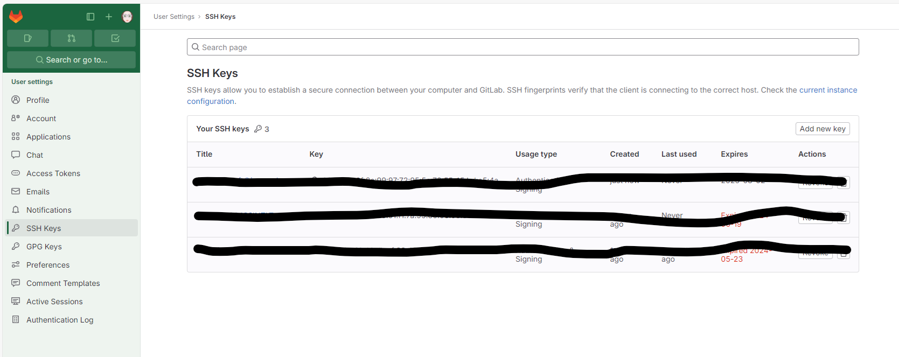

# ICR GitLab Installation

The ICR has an internal gitlab installation hosted at: [https://git.icr.ac.uk/](https://git.icr.ac.uk). This is internal to the ICR, accessible only on site or on the VPN.

## Setting up an ssh key
You may want access to the gitlab server from your local machine, or from Alma. To do this you will need to set up an ssh key and the instructions that follow are suitable for both Alma or your local machine, and will need to be done on both if you wish to access repositories from them.

### Step 1: Generate a new ssh key, if you need one

```bash
cd ~/.ssh
cat id_rsa.pub
# if it already exists you can skip the generation and go to Step 2
ssh-keygen -t rsa -C "edit-your-user-name@icr.ac.uk"
# To the questions that follow, just press enter to leave the responses blank
Enter file in which to save the key (/home/demo/.ssh/id_rsa):
Enter passphrase (empty for no passphrase):
Enter same passphrase again: 
```
There will be an output then along the lines:
```
Your identification has been saved in ~/.ssh/id_rsa.
Your public key has been saved in ~/.ssh/id_rsa.pub.
The key fingerprint is:
4a:dd:0a:c6:35:4e:3f:ed:27:38:8c:74:44:4d:93:67 demo@a
The key's randomart image is:
+--[ RSA 2048]----+
|          .oo.   |
|         .  o.E  |
|        + .  o   |
|     . = = .     |
|      = S = .    |
|     o + = +     |
|      . o + o .  |
|           . o   |
|                 |
+-----------------+
```

### Step 2: Paste the public part on GitLab
You now need to copy the public key and paste it into GitLab.  
- Open the file `~/.ssh/id_rsa.pub` with a text editor and copy the contents (or cat ~/.ssh/id_rsa.pub).  
- Go to the GitLab website and navigate to your profile settings on the left.  
- In the left hand menu, click on `SSH Keys`  
- Choose "Add new key" and paste the key into the box.  
- Click `Add Key` and you are done!.  




