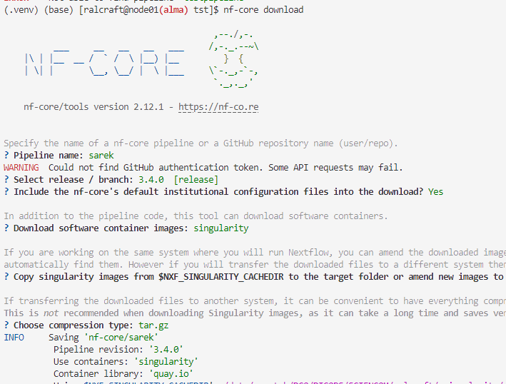

# Running nf-core on Alma - Setup and check

This tutorial covers running a simple test nf-core workflow on alma to santiy check access and modules are installed correctly and working and run a test. In part 2 [run sarek](nf-core-2.md).

## Step 1: Log on to an interactive node on Alma
    
```bash
# to alma
ssh username@alma.icr.ac.uk
# interactive session with 10GB memory and 2 cores
srun --pty --mem=10GB -c 2 -t 30:00:00 -p interactive bash    
```

## Step 2: Create an nf-core directory (or return to it)

```bash
cd /data/scratch/YOUR/PATH/GROUP/username/
mkdir nf-core
cd nf-core
```

## Step 3: Install the nf-core/tools package and python environment (or return to it)
You only need to install the python environment once, subsequently you can load it.  
If you are already in a python environment type ```deactivate``` to exit it.

- Creating the python environment
```bash
python -m venv .venv
source ./.venv/bin/activate
pip install --upgrade pip
pip install nextflow
pip install nf-core
```

- Reloading it in subsequent sessions
```bash
source ./.venv/bin/activate
```

## Step 4: Load java and export the singularity cache location
You will need to do this in every session
```bash
module load java/jdk15.0.1
export NXF_SINGULARITY_CACHEDIR=/data/scratch/YOUR/PATH/GROUP/username/.singularity/cache
```

## Step 5: Check the versions
```bash
nextflow -v
singularity --version
nf-core --version
```

## Step 6: Run the nf-core test workflow
The nf-core workflows can be run in 3 ways, either directly from github, or they can be downloaded first.
Although it is recommended to run them directly from github unless you are developing them, it can cause github access problems in an HPC environment, so I will describe them, with a preference for the github clone.

- 1. Running from github
```bash
mkdir testpipeline_run #the _run to distinguish it from when we manually pull
cd testpipeline_run
nextflow run nf-core/testpipeline -profile test,singularity --outdir my-outdir
```

- 2. Cloning from github and running
start back in the nfcore directory (```cd /data/scratch/YOUR/PATH/GROUP/username/nf-core``` or ```cd ..```)
```bash
git clone git@github.com:nf-core/testpipeline.git
cd testpipeline_run
nextflow run main.nf -profile test,singularity --outdir my-outdir
```

- 3. Using nf-core's download module
With this option, you download the entire workflow so it can be run offline. With the other options there is downloading as and when so eventually everythong will be downloaded - eg the singularity modules are downloaded on first use and the reused from the singulaity cach. With download, the entire thing is downlaoded into the given directory. This may not be desired. There can be problems with this functionality so go back to a previous mode if so.

For this you type in ```nf-core download``` and then follow the prompts:



## Step 7: Check the output
You will see that both of these created a work directory in the directory they were running from, and the output directory specified in the command. These will contain the output of the pipeline. The work directory is important for trouble shooting as any errrors will be in the logs there including all the data and parameters used in the commands that failed.